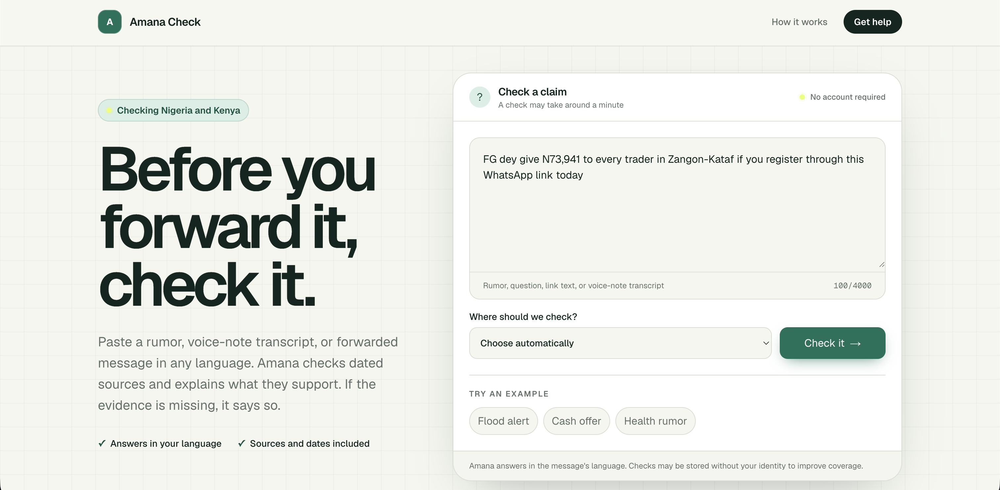
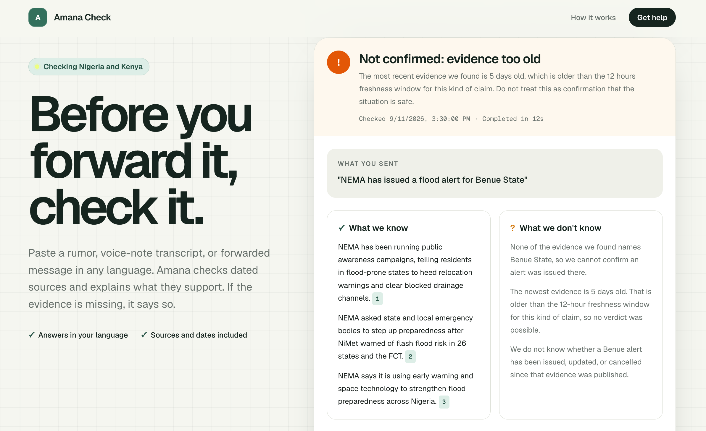
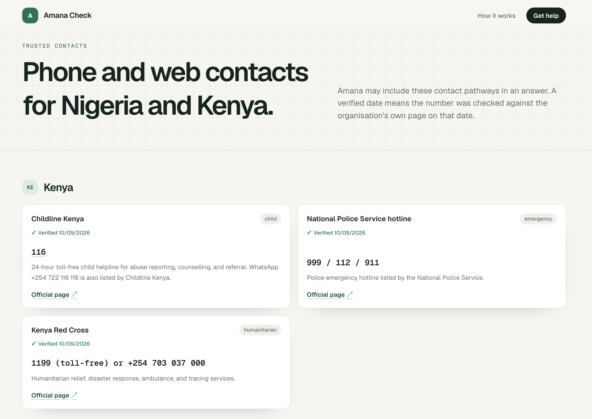

# Amana Check

**Check before you share.**

Amana Check is a community-facing trust layer for fragile information environments. A rumor or question arrives in any language. Amana answers in the same language with what is actually known, gives a source and a date for each fact, and says when it cannot tell. Local peacebuilders see an anonymous, aggregated signal of verification demand.

Built for the OSF × Andela hackathon "Information you can trust". Primary track: Stability & Social Cohesion. Complementary tracks: Transparency & Accountability, and Safety through referral pathways only.

## Status

The proof of concept works end to end. The corpus, trust engine, citizen experience, accountability loop, and hardening phases are complete. Submission artifacts remain.

- Eval, 2026-09-11: 14 of 14 claims pass, claim type 13 of 13, language detection 7 of 7, evidence coverage 1 of 1 applicable expectation, citation coverage 4 of 4 applicable answers, no errors, $0.032018 for the full run.
- Red-team: 11 checks pass, including live prompt injection, forged citations, and oversized input.
- Corpus: 26 enabled sources, 13 for Nigeria and 13 for Kenya, holding 273 documents.

The model never receives the corpus. Retrieval shortlists the highest-ranked chunk from up to 24 distinct documents and sends at most 8 excerpts, each capped at 700 characters; [docs/methodology.md](docs/methodology.md) explains the pipeline and its context budget.

See [docs/PLAN.md](docs/PLAN.md) for the frozen plan and [docs/constraints-matrix.md](docs/constraints-matrix.md) for the hackathon constraints mapped to code.

## Screenshots

The home page lets people submit a forwarded message or claim in any language and check it against the current corpus.



Results show the verdict, freshness explanation, cited evidence, and what remains unknown.



The help page lists verified contact pathways for Nigeria and Kenya.



## License

Amana Check is released under the [MIT License](LICENSE).

## Stack

- Next.js App Router, TypeScript strict, Tailwind CSS
- Postgres and Drizzle ORM with the postgres.js driver. Local Postgres in development, Neon in production.
- OpenRouter with DeepSeek 4.1 Flash and a DeepSeek 4 Flash fallback. Requests are hardcoded to zero-retention, no-training endpoints.
- Zod validation at every model boundary, with deterministic fallbacks.

## Setup

Requires [Bun](https://bun.sh) and a local Postgres.

```bash
bun install
createdb amana_check
cp .env.example .env
# then set OPENROUTER_API_KEY, APP_SECRET, ADMIN_PASSCODE, and CRON_SECRET
bun run db:setup
bun run ingest
bun run dev
```

`db:setup` runs `db:migrate` then `db:seed`. Both are idempotent, so it is safe to repeat. Generate `APP_SECRET` with `openssl rand -hex 32`. Ingestion is a separate step because it fetches the corpus over the network.

`DATABASE_URL_UNPOOLED` is required for ingestion because the overlap lock needs a direct Postgres session. For local Postgres, keep it equal to `DATABASE_URL`; in Vercel, set it to Neon’s direct connection string.

Ingestion falls back to `curl` for feeds that block other HTTP clients, including the ReliefWeb country feeds. curl ships with macOS and GitHub Ubuntu runners. Set `INGEST_CURL_FALLBACK=0` to disable the fallback and fail fast.

The Vercel Node runtime may not include the optional `curl` binary. A source that needs that fallback is recorded as failed for that run; use a publisher API or a runtime with curl available when that source must be covered in production.

## Deploy

`vercel.json` sets the build command to `bun run db:setup && bun run build`, then registers twelve production cron entries two hours apart. Each entry calls the authenticated `/api/cron/ingest` route; the route shuffles sources, processes four at a time, and returns its duration and counts. Set `DATABASE_URL` to the pooled Neon connection, `DATABASE_URL_UNPOOLED` to the direct one for migrations and ingestion locking, and `CRON_SECRET` to a random value in Vercel Production. Run `bun run ingest` locally whenever you want to refresh the corpus by hand.

Hobby cron entries can run once per day and may arrive anywhere inside the scheduled hour, so the twelve-entry schedule approximates a two-hour refresh. Pro projects can replace them with one `0 */2 * * *` entry for per-minute scheduling precision. Cron jobs run only on production deployments. To test the route locally, start the app and send `curl -H "Authorization: Bearer $CRON_SECRET" http://localhost:3000/api/cron/ingest`.

## Scripts

| Command                  | What it does                                                                                       |
| ------------------------ | -------------------------------------------------------------------------------------------------- |
| `bun run dev`            | Start the app                                                                                      |
| `bun run start`          | Run `db:setup`, then start the production build                                                    |
| `bun run build`          | Production build                                                                                   |
| `bun run typecheck`      | `next typegen` then `tsc --noEmit`                                                                 |
| `bun run lint`           | ESLint                                                                                             |
| `bun run test`           | Run the ingestion adapter behavior tests                                                           |
| `bun run format`         | Format with Prettier                                                                               |
| `bun run format:check`   | Verify formatting with Prettier                                                                    |
| `bun run db:generate`    | Generate Drizzle migrations from the schema                                                        |
| `bun run db:migrate`     | Apply migrations                                                                                   |
| `bun run db:push`        | Push the schema directly to the database                                                           |
| `bun run db:seed`        | Load region registries, sources, and referrals from `data/`                                        |
| `bun run db:setup`       | Run `db:migrate` then `db:seed`                                                                    |
| `bun run db:studio`      | Drizzle Studio                                                                                     |
| `bun run ingest`         | Fetch enabled sources into the corpus (flags: `--source`, `--country`, `--limit`, `--concurrency`) |
| `bun run ask`            | Run the full pipeline on a claim (flags: `--ng`, `--ke`, `--fresh`)                                |
| `bun run eval`           | Run the eval harness and write `eval/results/latest.json`                                          |
| `bun run check:llm`      | Verify the fail-closed OpenRouter path                                                             |
| `bun run check:pipeline` | Run extraction, retrieval, and the freshness gate on a sample claim                                |
| `bun run red-team`       | Run static privacy checks and live adversarial claims                                              |

## Docs

- [docs/methodology.md](docs/methodology.md): how answers are produced and validated
- [docs/threat-model.md](docs/threat-model.md): assets, threats, mitigations, residual risk
- [docs/constraints-matrix.md](docs/constraints-matrix.md): the seven brief constraints mapped to code
- [docs/future-directions.md](docs/future-directions.md): SMS, USSD, offline access, native review, expansion
- [docs/PLAN.md](docs/PLAN.md): the frozen plan

## Layout

```
src/app/                  UI, answer card, admin console, API routes
src/lib/admin/            Signed sessions, review queue, dashboard, brief export
src/lib/db/               Drizzle schema + client
src/lib/ingest/           RSS and HTML adapters, cleaning, chunking, upserts
src/lib/llm/              Fail-closed OpenRouter client, prompts, budget
src/lib/locale/           HMAC IP hashing, geo headers, location precedence
src/lib/pipeline/         Extraction, synthesis, orchestration, events
src/lib/referrals/        Action and hotline library
src/lib/registry/         Source, region, and referral schemas + loaders
src/lib/retrieval/        IDF-weighted full-text search
src/lib/trust/            Answer and claim types, freshness gate
data/regions/             Nigeria (36 + FCT) and Kenya (47 counties)
data/sources/             Source registries with tiers, licenses, adapter config
data/referrals/           Verified contact pathways with check dates
drizzle/                  Generated SQL migrations
scripts/                  Seed, ingest, ask, eval, red-team, checks
docs/                     Plan, methodology, threat model, constraints, future work
```

## Privacy posture

- `claims` stores de-identified input and has **no join keys** to any identifier.
- IPs are only ever `HMAC-SHA256(APP_SECRET, ip)` for rate limiting; raw IPs are never stored or logged.
- LLM routing is hardcoded to zero-retention, no-training endpoints. If none is available the request fails closed instead of degrading.
- Aggregated `events` are k≥3 and represent verification demand, not confirmed incidents.

See [docs/PLAN.md](docs/PLAN.md) for the retention tradeoff.
